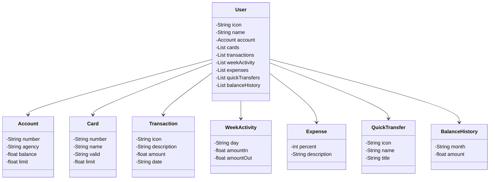

# Hands-On |  Spring API


> This project is for DIO platform study.
> 
> thecnologies that to use
> 
> 
> 
> 
> 
> 

## Steps

### Step 1 | create spring project

We can use the [Spring Initializr][link-initializr] for create our project.
This site is a good platform where we can create the structure our project quickly and easily.

#### tools that was use in this project

* Spring Web
* Spring Data JPA (_Java Persistence API_)
* H2 Database (_in-memory database that support JDBC API and R2DBC access_)
* PostgreSQL Driver

### Step 2 | versioning in one repository

We can use some repository platform such GitLab, GitHub, and so on.

#### steps for it
**in the platform (remote repository)**
1. create one account
2. create one repository in the chosen platform

**in the local terminal**
3. create a work folder
4. start `git init`
5. link with our remote repository `git remote add <url-of-our-remote-repository>`
6. after add or change some file, to do synchronize 

```bash
git commit -m"some message"
git push
```

### Step 3 | Abstraction 

In this [figma graph][link-figmaabstration] is where I did abstraction.

I use [Json editor online][link-jsoneditoronline] how tools for create abstraction.

```json
{
  "icon": "myPhoto",
  "name": "alefuentes",
  "account": {
    "number": "000000000-0",
    "agency": "0000",
    "balance": 1234.12,
    "limit": 10000.00
  },
  "cards": [
    {
      "number": "xxxx xxxx xxxx 0000",
      "name": "ale fuentes",
      "valid": "12/24",
      "limit": 10000.00
    }
  ],
  "transactions": [
    {
      "icon": "",
      "description": "Deposit from my",
      "amount": 150.00,
      "data": "28/03/2024"
    }
  ],
  "weekAtivity": [
    {
      "day": "sunday",
      "amountIn": 150.00,
      "amountOut": 75.00
    }
  ],
  "expense": [
    {
      "percent": 20,
      "description": "Investment"
    }
  ],
  "quickTransfer": [
    {
      "icon": "",
      "name": "Daniel Fuentes",
      "title": "Designer"
    }
  ],
  "balanceHistory": [
    {
      "month": "March",
      "amount": 575.00
    }
  ]
}
```

> 💡 **TIPs**: After get our abstraction we can use IA for generate our class representations.
>   How promtp, did use: 
> 
>   _Generate a class diagram (using Mermaid syntax) given the following JSON that represents a database user. Keep a simple structure and faithful to the model I will give:_

Next result of our Abstraction:



### Step 4 | Object Relations Mapping (ORM)


<!-- links -->
[link-initializr]:https://start.spring.io/
[link-figmaabstration]:https://www.figma.com/file/cimP7PYnrMeFyOkbLaX9TI/My-Prototype-Bank?type=design&node-id=1-5&mode=design
[link-jsoneditoronline]:https://jsoneditoronline.org/