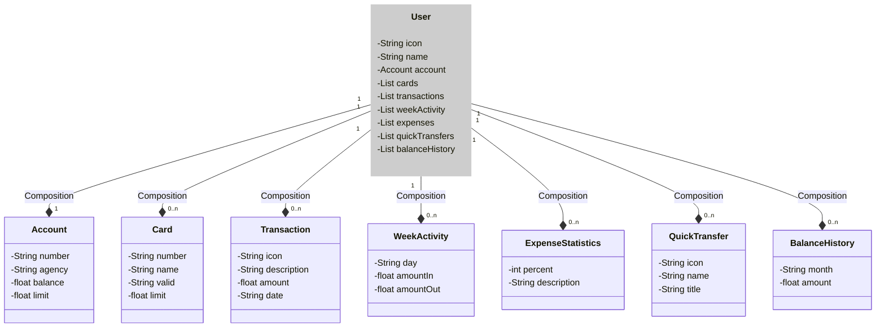

# Hands-On |  Spring API


> This project is for DIO platform study.
> 
> thecnologies that to use
> 
> 
> 
> 
> 
> 

## Steps

### Step 1 | create spring project

We can use the [Spring Initializr][link-initializr] for create our project.
This site is a good platform where we can create the structure our project quickly and easily.

#### tools that was use in this project

* Spring Web
* Spring Data JPA (_Java Persistence API_)
* H2 Database (_in-memory database that support JDBC API and R2DBC access_)
* PostgreSQL Driver

### Step 2 | versioning in one repository

We can use some repository platform such GitLab, GitHub, and so on.

#### steps for it
**in the platform (remote repository)**
1. create one account
2. create one repository in the chosen platform

**in the local terminal**
3. create a work folder
4. start `git init`
5. link with our remote repository `git remote add <url-of-our-remote-repository>`
6. after add or change some file, to do synchronize 

```bash
git commit -m"some message"
git push
```

### Step 3 | Abstraction 

In this [figma graph][link-figmaabstration] is where I did abstraction.

I use [Json editor online][link-jsoneditoronline] how tools for create abstraction. Next if my result to abstraction in JSON format:

```json
{
  "name": "alefuuu",
  "account": {
    "picture": "myphoto.jpg",
    "number": "1230032100-10",
    "agency": "0001",
    "balance": 1234.12,
    "accountLimit": 10000.00
  },
  "cards": [
    {
      "number": "xxxx xxxx xxxx 0010",
      "name": "ale fuuuu",
      "valid": "12/24",
      "cardLimit": 5000.00
    },
    {
      "number": "xxxx xxxx xxxx 0021",
      "name": "ale fuuuu 21",
      "valid": "08/25",
      "cardLimit": 7500.00
    }
  ],
  "transactions": [
    {
      "icon": "Nubank.jpg",
      "description": "Deposit from my",
      "amount": 150.00,
      "date": "28/03/2024"
    }
  ],
  "weekActivities": [
    {
      "activityDay": "Sunday",
      "amountIn": 150.00,
      "amountOut": 75.00
    }
  ],
  "expenseStatistics": [
    {
      "percent": 20.00,
      "description": "Investment"
    }
  ],
  "quickTransfers": [
    {
      "icon": "",
      "name": "Daniel Fuentes",
      "title": "Designer"
    }
  ],
  "balanceHistories": [
    {
      "monthBalance": "March",
      "amount": 575.00
    }
  ]
}
```

> 💡 **TIPs**: After get our abstraction we can use IA for generate our class representations.
>   How promtp, did use: 
> 
>   _Generate a class diagram (using Mermaid syntax) given the following JSON that represents a database user. Keep a simple structure and faithful to the model I will give:_

Next result of our Abstraction:



### Step 4 | Model Layer 

Create all models inner `model` package (_Object Relations Mapping (ORM)_).

Add configuration in `properties.yml` for access to H2 memory DB.

```yaml
application:
  title: API Rest Cloud - LAB
  version: v1.0
  author: Alejandro Fuentes - alefuentes.edu
spring:
  application:
    name: api-rest-cloud-lab-2024
  # Database
  datasource:
    url: jdbc:h2:mem:apirestlab2024
    username: alefu
    password: 
  jpa:
    show-sql: true
    open-in-view: false
    hibernate:
      ddl-auto: create # validate | update | create | create-drop
    properties:
      hibernate:
        format_sql: true
  h2:
    console:
      enabled: true
      path: /h2-console
      settings:
        trace: false
        web-allow-others: false
```

> OBS. we can see our H2 database using this link `http://localhost:8080/h2-console/`.
> 
> For connect see `properties.yml` file configuration, the section `h2`
> 

### Step 5 | Business Layer

In this step, to create the Service where to apply business rules.
The best practice says:

1. create a Service interface for my Entity
2. implement these Service interfaces in my class

### Step 6 | RESTful layer

Next, is time to create endpoints for clients can consume our service.
Now, for testing, we can incorporate in our project one tool called `swagger`, it is easy and friendly to use.

#### Swegger

See [OpenApi Swegger][link-springdoc-openapi] about how to use `Swegger`

```text
implementation 'org.springdoc:springdoc-openapi-starter-webmvc-ui:2.1.0'
```
After runned our project, test in browser the next link:
[http://localhost:8080/swagger-ui/index.html][link-swagger-localhost]


### Step 7 | Handler Exceptions

To centralize exceptions, I use the `controller.exception` package, which is used to create all exception handlers related to the RESTful API section.


<!-- links -->
[link-initializr]:https://start.spring.io/
[link-figmaabstration]:https://www.figma.com/file/cimP7PYnrMeFyOkbLaX9TI/My-Prototype-Bank?type=design&node-id=1-5&mode=design
[link-jsoneditoronline]:https://jsoneditoronline.org/
[link-springdoc-openapi]:https://github.com/springdoc/springdoc-openapi
[link-swagger-localhost]:http://localhost:8080/swagger-ui/index.html